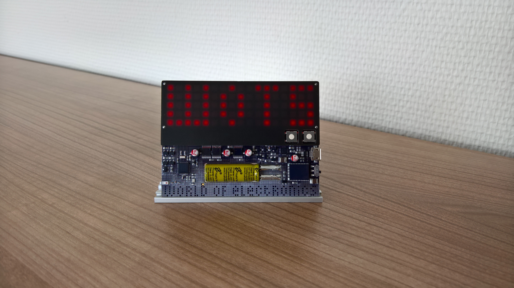

# What is the WoTS-Badge?
The WoTS-Badge is the official gadget of the WoTS World of Electronics! You'll see plenty of people walking around with one of these during the WoTS2016. It is an LED Matrix name tag with a twist.
Visitors that have collected their badge can put the pieces together and then have their name shown on the leds using either the app or the desktop application.
The WoTS-Badge is sponsored by many companies, one of those is SallandElectronics. SallandElectronics designed the electronics, firmware and smartphone apps.

# What can you do with it?
The badge has a LIVE mode which allows you to directly control the display matrix. You can connect via USB or wireless via BLE. The connection is fast enough to "stream" dynamic content. For example the display may seem to respond instantly to "gestures" made with the WaveNed wristband (gestures being very simple things like turning the wristband upside down).

You can read the manual [here](The hackers guide to the WoTS Badge.pdf)
